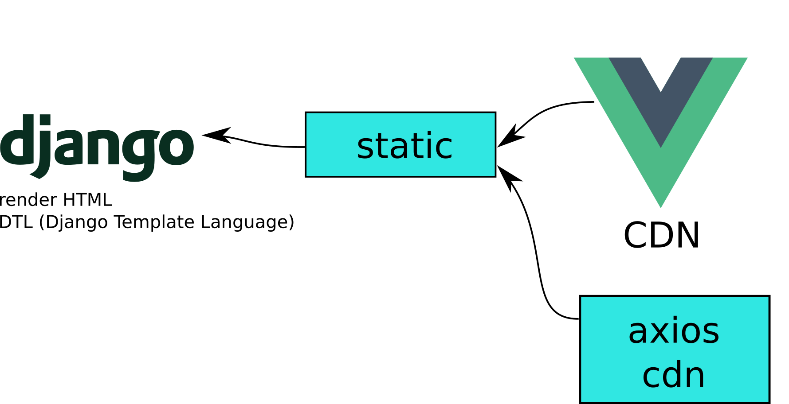

# django-vuejs-01-vue-inner-django

Neste projeto eu uso [Django][1] e sua renderização tradicional de templates, e uso o [VueJS][2] apenas como um arquivo estático via CDN. Inclui também [axios][3] via CDN.



## Como rodar o projeto?

* Clone esse repositório.
* Crie um virtualenv com Python 3.
* Ative o virtualenv.
* Instale as dependências.
* Rode as migrações.

```
git clone https://github.com/rg3915/django-vuejs-01-vue-inner-django.git
cd django-vuejs-01-vue-inner-django
python -m venv .venv
source .venv/bin/activate
pip install -r requirements.txt
python contrib/env_gen.py
python manage.py migrate
```


## Comandos pra criar o projeto do zero

### Criando o projeto Django

```
python -m venv .venv
source .venv/bin/activate
pip install -U pip; pip install django==2.2.12 django-extensions python-decouple dj-database-url
pip freeze > requirements.txt
django-admin startproject myproject .
cd myproject
python ../manage.py startapp core
cd ..
python manage.py migrate
# Crie um super usuário
python manage.py createsuperuser --username="admin"
```

#### Criando uma pasta chamada contrib com um env_gen.py

O comando a seguir pega `env_gen.py` do gist e clona na pasta `/tmp`.

```
git clone https://gist.github.com/22626de522f5c045bc63acdb8fe67b24.git /tmp/contrib; if [ ! -d contrib ]; then mkdir contrib; fi; cp /tmp/contrib/env_gen.py contrib/
# rode este comando para gerar o .env (variáveis de ambiente).
python contrib/env_gen.py
```

Em `settings.py` insira em `INSTALLED_APPS`...

```
INSTALLED_APPS = [
    ...
    'django_extensions',
    'myproject.core'
]
```

Edite este trecho do `settings.py`:

```
import os
from decouple import config, Csv
from dj_database_url import parse as dburl

BASE_DIR = os.path.dirname(os.path.dirname(os.path.abspath(__file__)))

# SECURITY WARNING: keep the secret key used in production secret!
SECRET_KEY = config('SECRET_KEY')

# SECURITY WARNING: don't run with debug turned on in production!
DEBUG = config('DEBUG', default=False, cast=bool)

ALLOWED_HOSTS = config('ALLOWED_HOSTS', default=[], cast=Csv())
```

E este trecho, onde vamos usar o sqlite:

```
default_dburl = 'sqlite:///' + os.path.join(BASE_DIR, 'db.sqlite3')
DATABASES = {
    'default': config('DATABASE_URL', default=default_dburl, cast=dburl),
}
```

No final do arquivo também edite:

```
LANGUAGE_CODE = 'pt-br'

TIME_ZONE = 'America/Sao_Paulo'
```

E

```
STATIC_URL = '/static/'
STATIC_ROOT = os.path.join(BASE_DIR, 'staticfiles')
```

Se você mudar a pasta default dos estáticos, então faça:

```
# opcional
STATICFILES_DIRS = [
    os.path.join(BASE_DIR, "static"),
    'myproject/core/templates/static/',
]
```

Depois entre na pasta

```
cd myproject/core/
```

e vamos editar o `views.py`.

```
cat << EOF > views.py
from django.shortcuts import render


def index(request):
    return render(request, 'index.html')
EOF
```

Agora vamos criar um `urls.py` na pasta `core`.

```
cat << EOF > urls.py
from django.urls import path
from myproject.core import views as v


app_name = 'core'


urlpatterns = [
    path('', v.index, name='index'),
]
EOF
```

Volte para a pasta `myproject` e edite o `urls.py` principal:

```
cd ..

cat << EOF > urls.py
from django.contrib import admin
from django.urls import include, path

urlpatterns = [
    path('', include('myproject.core.urls')),
    path('admin/', admin.site.urls),
]
EOF
```

### Criando os templates

Se você digitar `pwd` verá que está dentro da pasta `myproject`.

Então entre na pasta `core`:

```
cd core
```

Vamos criar os templates `base.html`:

```
mkdir templates

cat << EOF > templates/base.html
<!-- https://getbootstrap.com/docs/4.0/getting-started/introduction/#starter-template -->

<!doctype html>
<html lang="en">
  <head>
    <!-- Required meta tags -->
    <meta charset="utf-8">
    <meta name="viewport" content="width=device-width, initial-scale=1, shrink-to-fit=no">
    <link rel="shortcut icon" href="https://www.djangoproject.com/favicon.ico">
    <title>Django and VueJS</title>

    <!-- Bootstrap CSS -->
    <link rel="stylesheet" href="https://maxcdn.bootstrapcdn.com/bootstrap/4.0.0/css/bootstrap.min.css">

    <!-- Font-awesome -->
    <link rel="stylesheet" href="https://stackpath.bootstrapcdn.com/font-awesome/4.7.0/css/font-awesome.min.css">

    <link rel="stylesheet" href="">

    

  </head>
  <body>

    

    <div class="container">
      
    </div>

    <!-- VueJS -->
    <script src="https://cdn.jsdelivr.net/npm/vue/dist/vue.js"></script>

    <!-- axios -->
    <script src="https://cdn.jsdelivr.net/npm/axios/dist/axios.min.js"></script>

    <script src=""></script>

    <!-- Optional JavaScript -->
    <!-- jQuery first, then Popper.js, then Bootstrap JS -->
    <script src="https://code.jquery.com/jquery-3.3.1.min.js"></script>
    <script src="https://cdnjs.cloudflare.com/ajax/libs/popper.js/1.12.9/umd/popper.min.js"></script>
    <script src="https://maxcdn.bootstrapcdn.com/bootstrap/4.0.0/js/bootstrap.min.js"></script>

    
  </body>
</html>
EOF
```

E `index.html`:

```
cat << EOF > templates/index.html




<div id="app">
  <div class="jumbotron">
    <div class="container">
      <h1>Olá!</h1>
      <p>Este é um projeto feito com <a href="https://www.djangoproject.com/" target="_blank">Django</a> e <a href="https://vuejs.org/" target="_blank">VueJS</a>.</p>
      <p>
        <a href="https://github.com/rg3915/django-vuejs-01-vue-inner-django" target="_blank">Veja no GitHub</a>
      </p>
    </div>
  </div>
</div>


EOF
```

Vamos criar o menu:

```
mkdir templates/includes

cat << EOF > templates/includes/nav.html
<!-- https://github.com/JTruax/bootstrap-starter-template/blob/master/template/start.html -->

<nav class="navbar navbar-expand-md navbar-dark bg-dark fixed-top">
    <a class="navbar-brand" href="#">Home</a>
    <button class="navbar-toggler" type="button" data-toggle="collapse" data-target="#navbarsExampleDefault" aria-controls="navbarsExampleDefault" aria-expanded="false" aria-label="Toggle navigation">
        <span class="navbar-toggler-icon"></span>
    </button>

    <div class="collapse navbar-collapse" id="navbarsExampleDefault">
        <ul class="navbar-nav mr-auto">
            <li class="nav-item active">
                <a class="nav-link" href="">Home <span class="sr-only">(current)</span></a>
            </li>
            <li class="nav-item">
                <a class="nav-link" href="https://github.com/rg3915/django-vuejs-01-vue-inner-django" target="_blank">GitHub</a>
            </li>
        </ul>
    </div>
</nav>
EOF
```

### Criando os arquivos estáticos

Certifique-se de estar na pasta `core`.

```
mkdir -p static/{css,js}
```

Vamos criar um arquivo de estilo:

```
cat << EOF > static/css/style.css
body {
  margin-top: 60px;
}

.ok {
  color: green;
}

.no {
  color: red;
}

span.required:after {
  content: "*";
  color: red;
}
EOF
```

E um para o JS:

```
cat << EOF > static/js/myvue.js
var app = new Vue({
  el: '#app',
  delimiters: ['\${', '}'],
  data: {
    users: [
      { 'username': 'Huguinho' },
      { 'username': 'Zezinho' },
      { 'username': 'Luizinho' }
    ]
  }
})
EOF
```


#### Rodando o servidor Django

Vá para a mesma pasta onde está o `manage.py`.

```
python manage.py runserver
```

### Misturando o template do Django com os binds do VueJS.

Primeiro vamos criar alguns usuários no Django, para isso vá para a pasta onde está o `manage.py` e digite:

```
python manage.py shell_plus
```

Depois digite:

```
names = ['fulano', 'beltrano', 'cicrano']
[User.objects.create(username=name) for name in names]
```

Agora vamos reescrever `views.py`:

```
cat << EOF > myproject/core/views.py
from django.contrib.auth.models import User
from django.shortcuts import render


def index(request):
    users = User.objects.all()
    context = {'users': users}
    return render(request, 'index.html', context)
EOF
```

E vamos reescrever `index.html`:

```
cat << EOF > myproject/core/templates/index.html




<div id="app">
  <div class="jumbotron">
    <div class="container">
      <h1>Olá!</h1>
      <p>Este é um projeto feito com <a href="https://www.djangoproject.com/" target="_blank">Django</a> e <a href="https://vuejs.org/" target="_blank">VueJS</a>.</p>
      <p>
        <a href="https://github.com/rg3915/django-vuejs-01-vue-inner-django" target="_blank">Veja no GitHub</a>
      </p>
    </div>
  </div>
  <div class="row">
    <div class="col">
      <h3>Dados do VueJS</h3>
      <ul>
        <li v-for="user in users" :class="{'no': user.username == 'admin'}">\${ user.username }</li>
      </ul>
    </div>
    <div class="col">
      <h3>Dados do Django</h3>
      <ul>
        
          <li>{{ user }}</li>
        
      </ul>
    </div>
  </div>
</div>


EOF
```

### Acessando um endpoint do Django com Axios

Com o [axios][3] podemos fazer requisições ao servidor de backend através de um endpoint.

Em `views.py`:

```
from django.contrib.auth.models import User
from django.http import JsonResponse
from django.shortcuts import render


def index(request):
    users = User.objects.all()
    context = {'users': users}
    return render(request, 'index.html', context)


def api_users(request):
    users = User.objects.all()
    data = [
        {'username': user.username}
        for user in users
    ]
    response = {'data': data}
    return JsonResponse(response)
```

Em `core/urls.py`

```
from django.urls import path
from myproject.core import views as v


app_name = 'core'


urlpatterns = [
    path('', v.index, name='index'),
    path('api/users/', v.api_users, name='users'),
]
```

Em `myvue.js`

```
axios.defaults.xsrfHeaderName = 'X-CSRFToken'
axios.defaults.xsrfCookieName = 'csrftoken'

const endpoint = 'http://localhost:8000/'

var app = new Vue({
  el: '#app',
  delimiters: ['${', '}'],
  data: {
    users: [
      // { 'username': 'Huguinho' },
      // { 'username': 'Zezinho' },
      // { 'username': 'Luizinho' },
    ]
  },
  created() {
    axios.get(endpoint + 'api/users/')
      .then(response => {
        this.users = response.data.data;
      })
  }
})
```

[1]: https://www.djangoproject.com/
[2]: https://vuejs.org/
[3]: https://github.com/axios/axios
[4]: https://gist.github.com/rg3915/6fad3d19f2b511ec5da40cef5a168ca5
